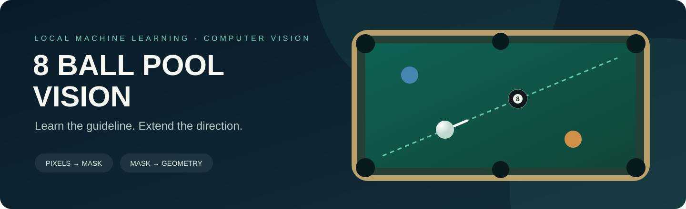
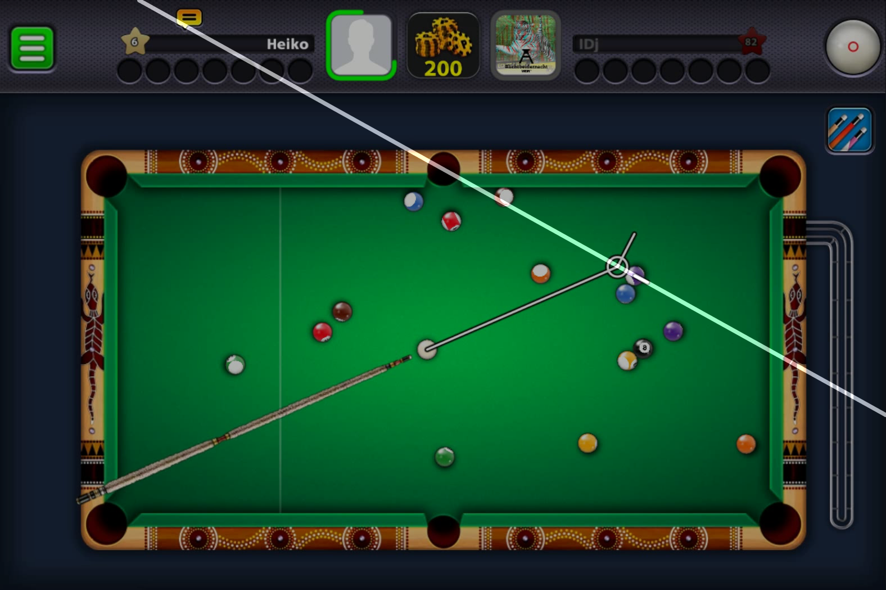
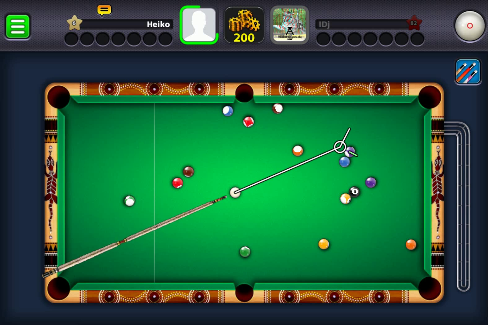

<p align="center">
  
</p>

<h1 align="center">8 Ball Pool Vision &amp; Machine Learning</h1>

<p align="center">
  <strong>From a faint white guideline to a readable direction.</strong><br>
  Local model training, carefully prepared labels, and geometric line extension.
</p>

<p align="center">
  <a href="docs/CUE_LINE_EXTENSION.md">Original model guide</a> ·
  <a href="docs/OBJECT_BALL_GUIDELINE.md">Later research guide</a> ·
  <a href="docs/CHECKPOINTS.md">Checkpoints</a> ·
  <a href="docs/PROJECT_HISTORY.md">Project history</a>
</p>

## The idea

8 Ball Pool displays short white guidelines that can be difficult to see when they are thin, faint, or very small. This project trains local segmentation models on screenshots and binary masks, then uses the predicted pixels to make the selected line easier to interpret.

The original system learns a line mask and fits a straight line through its pixels. It extends that line to the captured image boundaries. The later research system concentrates on identifying the **object-ball outgoing guideline** after cue-ball contact, using cropped segmentation models, learned candidate ranking, and carefully evaluated rescue policies.

These are two related systems with different output conventions. Their architectures, checkpoints, labels, and preprocessing are kept together with the code that uses them.

| | Original line extension | Later outgoing-guideline research |
|---|---|---|
| Directory | [`cue_line_extension/`](cue_line_extension/) | [`object_ball_guideline/`](object_ball_guideline/) |
| Core model | U-Net, 38 base channels | Guideline U-Net, crop-based inference |
| Output | Selected line mask plus straight-line extension to image edges | Localized object-ball outgoing guideline mask |
| Training entry point | `ML.py` | `src/supervised/train.py` |
| Inference entry point | `preview.py` / `live_inference.py` | `predict.py` using the promoted manifest |
| Latest selected state | Fine-tuned epoch 247; historical live model epoch 241 also included | Promoted `v47b_roi_expand_selector_probe` policy, retaining the v2 primary model |

## See the dataset

This is an unchanged historical manual-label example. The annotation extends the selected short guideline through the full frame; it is a **training label**, not a newly generated model prediction.

<table>
  <tr><th>Original screenshot</th><th>Manual extended-line overlay</th></tr>
  <tr>
    <td></td>
    <td></td>
  </tr>
</table>

The corresponding [binary mask](assets/manual_mask.png) is included. The current original dataset has **4,666 image/mask/overlay triplets at its root**. The complete datasets and recordings remain local; this repository includes the preparation tools, a representative triplet, model weights, and training records.

## How the original system works


The extension is geometric postprocessing. It does not simulate collisions, cushions, spin, or the outcome of a shot. Manual labels determine which guideline the original model learns. The later project explicitly treats the cue-ball aiming line, cue stick, forbidden-circle line, and unrelated white UI features as negative material.

### Correct label and localized model output

The left panel shows the correct full-line **manual training label**: one straight white extension through the selected short guideline. The right panel shows the later promoted detector's actual localized prediction in green. Both use the same screenshot. The manual label illustrates the intended extension; it is not a model-generated result or evidence that the original model's extension bug has been fixed.

<table>
  <tr><th>Correct full-line label (manual annotation)</th><th>Later localized outgoing-guideline detector</th></tr>
  <tr>
    <td></td>
    <td></td>
  </tr>
</table>

The original epoch-247 prediction previously shown here has an incorrect geometric extension and stray yellow segments. It is preserved as a [known failure](docs/VALIDATION.md#known-original-extension-failure), rather than presented as a correct result. The localized prediction is a single-frame execution example, not an independent accuracy benchmark.

## Get the code and actual weights

Install [Git LFS](https://git-lfs.com/) before cloning. GitHub stores these weights through [Git Large File Storage](https://docs.github.com/en/repositories/working-with-files/managing-large-files/about-git-large-file-storage), so a clone without LFS can contain small pointer files instead of usable checkpoints.

```powershell
git lfs install
git clone https://github.com/MyMyMy5/Machine_Learning_Code_And_8_Ball_Pool_Vision_Model.git
cd Machine_Learning_Code_And_8_Ball_Pool_Vision_Model
git lfs pull
python tools/verify_artifacts.py
```

The package includes **19 checkpoint files**, about **808 MiB** in total: three original checkpoints, every model required by the promoted later policy, and the latest rejected specialist retained as a clearly identified research artifact. [CHECKSUMS.sha256](CHECKSUMS.sha256) and [MODEL_REGISTRY.json](MODEL_REGISTRY.json) record integrity, origin, timestamps, and roles.

## Run the original full-line model

Use Python 3.12 or 3.13. Create an environment and install a matching PyTorch/torchvision build for your device using the [official PyTorch installation selector](https://pytorch.org/get-started/locally/), then install the remaining requirements:

```powershell
python -m venv .venv
.\.venv\Scripts\Activate.ps1
python -m pip install -r cue_line_extension/requirements.txt
cd cue_line_extension

# Example input is copied into its own directory so preview.py sees only images.
New-Item -ItemType Directory -Force samples/demo_input | Out-Null
Copy-Item ../assets/original_frame.png samples/demo_input/
python preview.py --checkpoint checkpoints/checkpoint_epoch_247_best.pth --images samples/demo_input --output samples/demo_predictions --device cpu
```

For the model used by the preserved live-inference commands, replace the checkpoint with `checkpoints/checkpoint_epoch_241_best.pth`. GPU execution uses `--device cuda` with a compatible PyTorch build. See the [original guide](docs/CUE_LINE_EXTENSION.md) for live capture, annotation controls, training, and retraining.

## Run the later detector

From the repository root, install the later dependencies into a suitable environment, then use the portable manifest entry point:

```powershell
python -m pip install -r object_ball_guideline/requirements-publication.txt
cd object_ball_guideline
python predict.py --input ../assets/original_frame.png --output runs/demo_prediction
```

All promoted model branches and policy values are preserved. The publication manifest uses relative checkpoint paths, and the wrapper resolves them against the package directory. The two external rescue models are included with their local architecture and runtime source. Historical launchers and notes retain the original workstation paths for provenance; the new `predict.py` entry point is the portable route.

## Research results and their limits

| Historical result | Recorded value | Interpretation |
|---|---:|---|
| Original epoch-241 validation Dice | 0.447653 | Original training-log metric |
| Original fine-tuned epoch-247 validation Dice | 0.451056 | Best recorded fine-tune validation-loss checkpoint |
| Later v47b old validation Dice | 0.892591 | Recorded frozen benchmark result |
| Later v47b hard validation Dice | 0.965974 | Recorded frozen hard-set result |
| Later v47b supplemental positives Dice | 0.867796 | Recorded supplemental evaluation result |
| Later v47b frozen negatives | 0 / 376 false positives | Recorded negative-set gate |
| Later v47b supplemental negatives | 4 / 1,159 false positives | Known remaining false positives |

The systems use different labels, data, splits, and inference policies, so these metrics should not be compared as a single model leaderboard. The later policy contains hand-gated recovery rules developed against known failure boards. The records do not establish performance on every new game frame. Publication validation is reported separately in [VALIDATION.md](docs/VALIDATION.md).

## A project with a history

The owner remembers starting this project in **late 2024**. That recollection is preserved here. The surviving original source timestamps begin in September 2025, and saved checkpoints begin in October 2025; they do not establish the original creation date.

The latest original checkpoint still present was saved on **October 17, 2025 at 06:42:59 PDT**. Later object-ball research continued through the recorded **May 22, 2026** promotion of v47b. The newest later checkpoint, v46, was rejected; it does not replace the active primary model.

## Repository map

```text
.
├── cue_line_extension/          Original model, annotation, capture and training tools
│   ├── checkpoints/            Epoch 241 best, epoch 247 fine-tuned best, epoch 250 final
│   ├── experiments/            Earlier classical vision and click-overlay prototypes
│   └── training_history/       Preserved metrics across original training runs
├── object_ball_guideline/      Later supervised research pipeline
│   ├── src/                    Models, data, training, proposals, inference and ranking
│   ├── tools/                  Dataset building, diagnosis, evaluation and veto training
│   ├── tests/                  Existing regression tests
│   ├── runs/                   Promoted manifest, required weights and selected histories
│   ├── external_guideline/     Local rescue architecture, weights and related dataset tools
│   └── docs/experiments/       Preserved progress, handoff, decisions and experiment log
├── docs/                       Guides, history, checkpoint catalog and validation evidence
├── assets/                     Banner and one historical dataset example
├── tools/verify_artifacts.py    Portable checksum and manifest dependency check
├── MODEL_REGISTRY.json         Source provenance and checkpoint roles
└── CHECKSUMS.sha256             Checkpoint SHA-256 hashes
```

Publication copies preserve the research sources. The complete datasets, virtual environments, recordings, duplicate epoch archives, and unrelated demo scripts are not part of this distribution. The original recorded commands are available in [historical_commands.txt](docs/historical_commands.txt).
