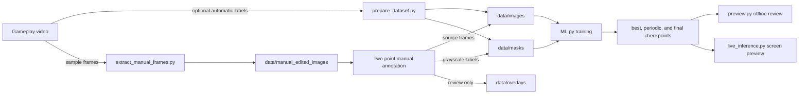

# Original full-frame cue-line extension model

This guide documents the original 8 Ball Pool screenshot project in `cue_line_extension/`. Its purpose was to segment a selected white directional guideline and extend a straight line from that label across the screenshot. The project name and older code comments call this a “cue line,” but the archived manual labels do not always identify the same in-game guide: one reviewed example follows the short outgoing guideline at a purple object ball, separate from the long cue-ball-to-reticle aiming line. Read the masks as the source of truth for what the model was trained to segment; do not assume every frame uses one universal cue-ball-connected target.

The curated publication examples show the unannotated frame, its manual overlay, and the corresponding grayscale training mask:

| Source frame | Manual overlay | Training mask |
| --- | --- | --- |
|  |  |  |

## Repository contents and data

`ML.py` defines the original PyTorch U-Net (`base_channels=38`), dataset reader, training loop, and checkpoint writer. `prepare_dataset.py` extracts video frames and makes heuristic line masks. `extract_manual_frames.py` prepares extra frames for hand labeling, and `manual_annotation_tool.py` lets you define a line with two points. `preview.py` makes offline overlays; `live_inference.py` applies the model to a monitor or screen region. The package also includes the historical checkpoint files described in the project history.

The full original training dataset is not included. To train, create this structure under `cue_line_extension/` and use matching image and mask filenames:

```text
data/
├── images/                 # original, unannotated frames
├── masks/                  # grayscale line masks; same filenames as images
├── overlays/               # optional human-review images; not read by ML.py
└── manual_edited_images/   # optional queue for hand annotation
```

Use PNG when possible so the source frames and thin mask lines stay lossless. The trainer searches `images/` for PNG, JPG, and JPEG files and requires a same-named file under `masks/`. It resizes both to 512 × 512 by default; masks use nearest-neighbor resizing. The validation split defaults to 20% with seed 42. The curated images linked above are documentation examples, not a substitute for the complete training dataset.

## Windows PowerShell quick start

Run the scripts from `cue_line_extension/`; all relative paths below are relative to that directory. Create an environment and install the packaged dependencies:

```powershell
Set-Location .\cue_line_extension
python -m venv .venv
.\.venv\Scripts\Activate.ps1
python -m pip install --upgrade pip
python -m pip install -r requirements.txt
```

To make your own gameplay recordings, first select the game area on the desired
monitor. Choose the monitor index for your display setup:

```powershell
python calibrate_region.py --monitor 1 --save-json config/region.json
```

Click the game area's top-left and bottom-right corners. The tool saves the
monitor and rectangle; press **Q** or **Esc** to close it. Record that rectangle:

```powershell
python record_cropped_monitor.py --region-json config/region.json --fps 30 --preview
```

Press **Q**, **Esc**, or **Ctrl+C** to stop. The timestamped video is saved under
`recordings/`, ready for manual frame extraction. For automatic labeling, place
the desired videos under `data/raw_videos/` (or pass `recordings` as the input
directory).

For heuristic labels from local gameplay videos, place supported video files under `data/raw_videos/` and run:

```powershell
python prepare_dataset.py `
  .\data\raw_videos `
  .\data\images `
  .\data\masks `
  --frame-stride 5 `
  --min-line-count 1 `
  --store-overlay
```

This writes extracted frames and masks plus optional overlays for review. It is the historical pseudo-label path; the manual workflow below is useful for examples where the heuristic misses the selected thin or small guide. Review automatic labels with:

```powershell
python review_overlays.py --overlays data/overlays --images data/images --masks data/masks
```

The reviewer advances accepted examples and moves discarded or flagged triplets
into `rejected/` or `fix/` folders. Its decisions are appended to
`data/review_log.txt`. `extract_frames.py` is also retained as a general-purpose
extractor; the saved commands used it to build `samples/val_preview` for checking
predictions.

If you have local gameplay recordings and want to hand-label selected frames, extract a sparse set first. This command does not clear the output directory; filename collisions are skipped.

```powershell
python extract_manual_frames.py `
  --input .\recordings `
  --output .\data\manual_edited_images `
  --stride 15 `
  --image-ext .png
```

Start the manual labeler with smaller click markers for precise placement:

```powershell
python manual_annotation_tool.py --point-radius 2
```

For each image, click two points along the selected guide. The tool draws a straight line through them and extends it to the image bounds. Press **Space** or **Enter** to save. By default, the annotated source frame is moved into `data/images/`, its grayscale mask goes into `data/masks/` (six-pixel line thickness by default), and its review overlay goes into `data/overlays/`. Add `--copy-source` if you want to retain the frame in `data/manual_edited_images/`; existing outputs are protected from overwrite and will be skipped if encountered again.

| Input | Action |
| --- | --- |
| Left click | Add a point; after two points, the next click starts a new pair |
| Mouse wheel | Zoom in or out around the pointer |
| Backspace | Remove the last point |
| `R` | Clear both points |
| `S` | Skip this image and leave it in the source folder |
| `D` | Move the image into `data/manual_edited_images/_discarded/` |
| Space or Enter | Save after two valid points are placed |
| Esc or `Q` | Quit the annotation session |

After you have image/mask pairs, train into a new, unused run directory so existing checkpoints are not overwritten:

```powershell
python ML.py .\data .\runs\cue_line_run_01 `
  --num-epochs 50 `
  --batch-size 4 `
  --num-workers 0 `
  --device auto
```

`auto` selects CUDA when PyTorch reports it available and otherwise uses CPU. Training logs are appended to `metrics.jsonl`; checkpoints include validation-loss bests, periodic snapshots, and a final snapshot. The “best” tag is selected by lowest validation loss, while Dice is logged as a separate metric. If you use `--resume`, training starts at the saved epoch plus one and `--num-epochs` is the final epoch number, so set it above the checkpoint epoch.

To make offline overlays from an image directory:

```powershell
python preview.py `
  --checkpoint .\checkpoints\checkpoint_epoch_241_best.pth `
  --images .\data\images `
  --output .\runs\preview_epoch_241 `
  --device cpu `
  --threshold 0.35 `
  --line-thickness 6
```

The preview thresholds the predicted mask, fits a straight line when enough foreground pixels are present, and draws the refined result across the frame. Its default threshold is 0.35; the fitter requires at least 50 pixels. Point `--images` at a directory containing only image files; the script processes every direct entry in that directory. This output is for visual review and is not a new ground-truth mask.

For live screen preview, use a monitor index or supply a capture rectangle in `left,top,width,height` order. Coordinates need to match your own display setup.

```powershell
python live_inference.py `
  --checkpoint .\checkpoints\checkpoint_epoch_241_best.pth `
  --region-json .\config\region.json `
  --device auto
```

Use `--region 493,231,1576,1051` only as a syntax example; replace it with the rectangle for your own capture, or calibrate a local `config/region.json`. The live script displays an overlay and an FPS estimate; it does not control the game. Press **Q** or **Esc** to close its window.

## Workflow



## Interpretation and limits

The labeler paints a full straight line through the two chosen points to the frame edges. That is the dataset’s geometric target; it does not establish that the selected in-game guide is physically followed by the cue ball or that the system predicts shot outcomes. Model previews and archived validation metrics should be treated as research artifacts. They do not establish reliable gameplay performance, live latency, or accuracy on a newly collected screen setup.
